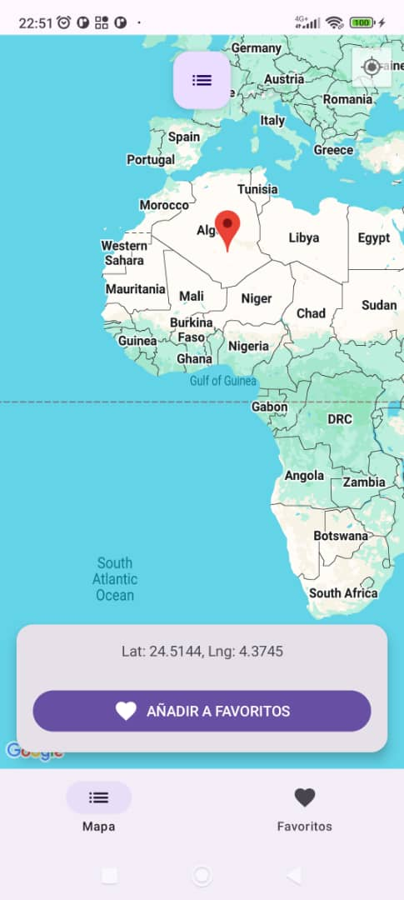
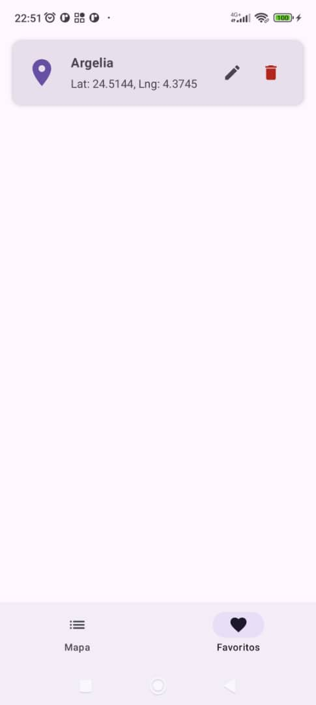

#  Aplicación de Mapas y Favoritos

Aplicación Android nativa que implementa Google Maps para la visualización y gestión de lugares favoritos. 
.

##  Capturas de Pantalla
Anadir Favorito

Seleccionar Favorito en el mapa

Listado de Favoritos

## ✨ Funcionalidades

*   **Mapa Interactivo:**
    *   Se centra automáticamente en la ubicación actual del usuario al iniciar solicitando los permisos necesarios 
        para permitir la localizacion.
    *   Permite la selección de cualquier punto en el mapa, moviendo la cámara y mostrando un marcador.
    *   Muestra un etiqueta lascoordenadas del punto seleccionado.

*   **Gestión de Favoritos:**
    *   Crear: Añadir un lugar favorito desde un punto seleccionado en el mapa.
    *   Leer: Visualizar todos los favoritos en una lista dedicada en una pantalla aparte y con marcadores personalizados 
    *    en el mapa que se quedan guardados.
    *   Actualizar: Editar el título con otro nombre.
    *   Eliminar: Borrar un favorito desde la lista.

*   **Navegación Inferior:**
    *   Una barra de navegación inferior permite cambiar entre la vista del **Mapa** y la de **Favoritos**.

*   **Funcionalidades Adicionales Implementadas:**
    *   Cálculo de Distancia: Muestra la distancia en línea recta desde la ubicación del usuario a un punto seleccionado en el mapa.
    *   Selector de Tipo de Mapa: Permite cambiar la vista del mapa entre Normal, Satélite, Híbrido y Terreno.
    *   Soporte de Orientación: La interfaz se adapta correctamente a la vista horizontal y vertical.
    *   Boton de Localizacion Actual: Busca nuestra localizacion actual.

##  Arquitectura y Decisiones Técnicas

El proyecto está construido de la siguiente forma:

*   Lenguaje: 100% Kotlin, utilizando coroutines para asincronía y Flows .
*   Interfaz de Usuario: Jetpack Compose, la herramienta moderna de Android para construir UI nativa de forma declarativa.
*   Arquitectura: MVVM (Model-View-ViewModel) para una clara separación de responsabilidades.
    *   View (Compose): Capa de UI reactiva que observa cambios de estado y delega la lógica.
    *   ViewModel: Contiene la lógica de la UI, gestiona el estado a través de `StateFlow` y se comunica con el Repositorio. Sobrevive a cambios de configuración.
    *   Model: Compuesto por:
        *   Repositorio: Centraliza el acceso a los datos, actuando como única fuente de verdad.
        *   Room: Base de datos local para la persistencia de los favoritos de forma robusta y eficiente.
        *    Retrofit biblioteca para un rapido y facil acceso peticiones.
*    Gestión de Estado: Se utiliza `StateFlow` para exponer el estado de la UI desde el `ViewModel` de una manera reactiva y segura para la concurrencia.
*   Navegación: Se implementa con **Navigation Compose** para gestionar las transiciones entre la pantalla del mapa y la de favoritos.
*   Dependencias Clave:
    *   `maps-compose`: Para integrar Google Maps de forma nativa en Compose.
    *   `play-services-location`: Para obtener la ubicación del usuario de forma eficiente.
    *   `Room`: Para la base de datos local.
    *   `Accompanist Permissions`: Para un manejo declarativo y limpio de los permisos en tiempo de ejecución.

##  Demostración en Video
